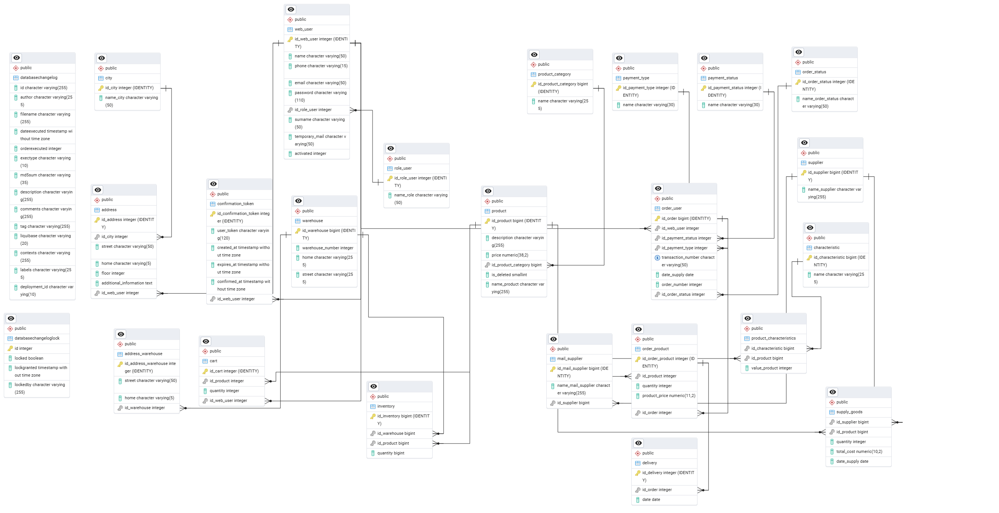

# online-shop-product

>Description:
>This module is part of a larger Spring Boot-based REST API for an online shop powered by PostgreSQL.
>It manages product catalog, product supply operations, and warehouse inventory tracking.
>The service comes with built-in Swagger API documentation and supports containerized deployment via Docker for straightforward setup and scalability.

Database layout in pgAdmin 4

_________
## Swagger REST API docs:
http://localhost:8092/swagger-ui/index.html#/
_________

## Models

+ city
+ address
+ role_user
+ web_user
+ address_warehouse
+ warehouse
+ confirmation_token
+ inventory
+ product
+ cart
+ product_characteristics
+ order_product
+ delivery
+ product_category
+ supply_goods
+ payment_status
+ order_user
+ characteristic
+ mail_supplier
+ supplier
+ payment_type
+ order_status
+ payment_status
_________

### 🔗 Related Modules

- **User Service**  
  Handles user registration, authentication, shopping cart, and order processing.  
  [➡ View on GitHub](https://github.com/LestFeeD/online-shop-user)

